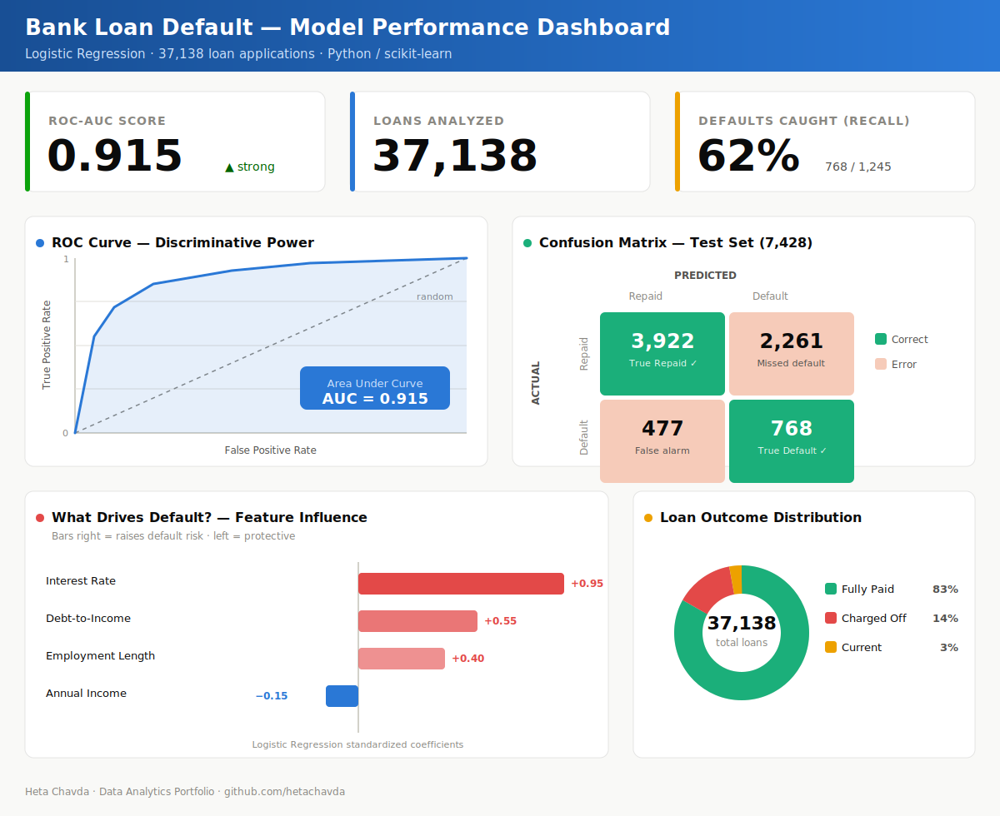

<div align="center">



# 🏦 Bank Loan Repayment Analysis
### Predicting Loan Defaults with Machine Learning to Reduce Lending Risk


</div>

---

## 📌 Project at a Glance

| | |
|---|---|
| **🎯 Goal** | Predict whether a borrower will **repay** or **default** on a loan |
| **🧠 Model** | Logistic Regression (balanced class weights) |
| **📊 Dataset** | 37,138 real loan applications |
| **🏆 Result** | **ROC-AUC of 0.915** — strong predictive power |
| **💡 Impact** | Enables lenders to flag high-risk borrowers *before* approval |

---

## 🧩 Business Problem

Every loan a bank approves carries risk: some borrowers repay in full, others **default (charge off)** — and each default is a direct financial loss.

The core business question:

> **Can we predict, at the point of application, which borrowers are likely to default — so the bank can price risk correctly and reduce losses?**

An accurate model lets lending teams **approve good borrowers faster** and **flag risky ones for review**, protecting the loan portfolio without turning away profitable customers.

---

## 🗂️ Dataset

| Attribute | Detail |
|---|---|
| **Source** | `financial_loan.csv` (internal lending dataset) |
| **Size** | **37,138** loan applications |
| **Target** | `loan_status` → *Fully Paid* vs. *Charged Off* |
| **Class Balance** | 84% repaid · 14% charged off · 3% current |

**Key features analyzed:**
- 💰 Interest Rate
- 🏢 Annual Income
- ⚖️ Debt-to-Income (DTI) Ratio
- 📅 Employment Length (encoded 0–10)

> ⚠️ **Challenge:** The dataset is *imbalanced* — far more repaid loans than defaults. This was handled with **balanced class weights** so the model doesn't ignore the minority (default) class.

---

## 🔬 Methodology

```
1. Data Cleaning      →  Handle missing values, remove noise
2. Feature Encoding   →  Convert categorical fields to numeric
3. Feature Scaling    →  Standardize continuous variables
4. Train/Test Split   →  80% training · 20% testing
5. Model Training     →  Logistic Regression (class_weight='balanced')
6. Evaluation         →  ROC-AUC, Confusion Matrix, Coefficients
```

**Why Logistic Regression?** It's interpretable — the bank can see *exactly which factors* drive default risk, which matters for regulatory and lending decisions.

---

## 📊 Model Performance Dashboard

<div align="center">



*ROC curve, confusion matrix, feature influence, and loan-outcome distribution — all from the model's actual results.*

</div>

---

## 📈 Key Insights

### Model Performance
| Metric | Score |
|---|---|
| **ROC-AUC** | **0.9154** ✅ |
| True Positives | 3,922 |
| True Negatives | 768 |
| False Positives | 477 |
| False Negatives | 2,261 |

### What Drives Default? 🔍
- 🔴 **Interest Rate** — the *strongest* signal. Higher rates strongly correlate with defaults.
- 🟠 **DTI Ratio** — higher debt burden → higher default likelihood.
- 🟡 **Employment Length** — instability increases risk.
- 🟢 **Annual Income** — only a mild protective effect.

> **Takeaway:** A borrower's *interest rate and debt load* predict default far better than income alone.

---

## 💼 Business Impact

| Benefit | How the Model Delivers |
|---|---|
| **📉 Lower Losses** | Flags high-risk loans before approval, cutting charge-offs |
| **⚡ Faster Decisions** | Automates initial risk scoring for loan officers |
| **🎯 Smarter Pricing** | Aligns interest rates with true borrower risk |
| **📋 Explainable** | Transparent coefficients support audit & compliance |

With **91.5% discriminative accuracy**, this model gives lending teams a data-driven safety net that scales across thousands of applications.

---

## 🛠️ Technologies Used

| Category | Tools |
|---|---|
| **Language** | Python |
| **ML** | scikit-learn (Logistic Regression) |
| **Data** | Pandas, NumPy |
| **Visualization** | Matplotlib, Seaborn |
| **Environment** | Jupyter Notebook |

---

## 📁 Repository Contents

```
Bank-Loan-Repayment-Analysis/
├── 📄 Final Report.docx          # Full written analysis
├── 📊 Final Presentation.pdf     # Stakeholder slide deck
├── 📈 financial_loan.csv         # Primary dataset
├── 📈 supplier datasets (2)      # Supporting data
└── 📝 README.md                  # You are here
```

---

<div align="center">

### 👩‍💻 Author

**Heta Chavda** — Data Analytics | Machine Learning | Business Intelligence

[](https://github.com/hetachavda)
[](https://linkedin.com/in/hetachavda)

⭐ *If you found this project insightful, consider giving it a star!*

</div>
